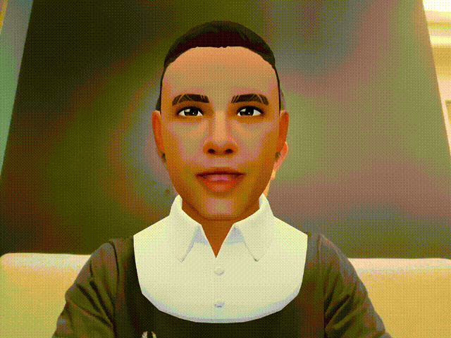

# 🎭 Face2Avatar  

**Face2Avatar** is a dynamic full-stack web application that brings avatars to life by tracking real-time facial expressions and syncing them with a customizable digital avatar. Built on top of [MediaPipe’s Face Landmarker](https://developers.google.com/mediapipe) and 3D avatar frameworks, this project combines cutting-edge computer vision with expressive 3D rendering.  

---

## 🧠 Abstract  

The Face2Avatar project bridges the gap between **real facial expressions** and **virtual character interactions**. It allows users to:  
- 🎨 Customize their avatars to reflect their personality.  
- 📷 Use a camera to track facial movements in real-time.  
- 🎬 Capture snapshots and record animated reactions.  
- 😄 Mirror real-time facial expressions on animated 3D avatars.  

This project is ideal for entertainment, virtual communication, gaming, and education — anywhere interactive avatars can enhance user experience.  

---

## 🛠️ Technologies Used  

- **Frontend:**  
  - React.js  
  - Next.js 13  
  - HTML5, CSS3, JavaScript ES6  
  - TailwindCSS (for styling)  

- **Libraries & Tools:**  
  - [MediaPipe Face Landmarker](https://developers.google.com/mediapipe) – real-time face tracking  
  - [Three.js](https://threejs.org/) & [react-three-fiber](https://github.com/pmndrs/react-three-fiber) – 3D rendering  
  - [Ready Player Me](https://readyplayer.me/) avatars integration (customizable)  
  - Webcam access via MediaDevices API  
  - CSS animations & transitions  

- **Backend:**  
  - Express.js (API handling)  

- **Other Tools:**  
  - Visual Studio Code  
  - Git & GitHub for version control  
  - Vercel for deployment  

---

## 🚀 Features  

- Real-time face tracking using **MediaPipe**  
- 3D avatar face animation using **52 blendshapes**  
- Avatar customization (hair, eyes, accessories, etc.)  
- Start/stop camera interaction  
- Snapshot capture & saved gallery  
- Record & replay avatar animations  
- Smooth and modern UI/UX flow  

---

## 📂 How It Works  

1. **Customize** your avatar (appearance, accessories, style).  
2. **Start** the camera → Facial landmarks are detected in real-time.  
3. **Animate** → The avatar mirrors your expressions dynamically.  
4. **Capture** → Take snapshots or record expressive reactions.  

---

## 🧑‍💻 Getting Started  

### Prerequisites  
- [Node.js](https://nodejs.org/en/download/) (latest LTS recommended)  

### Installation  

1. Clone the repository:  
   ```bash
   git clone https://github.com/your-username/face2avatar.git
   ```  

2. Navigate into the project folder:  
   ```bash
   cd face2avatar
   ```  

3. Install dependencies:  
   ```bash
   npm install
   ```  

4. Start development server:  
   ```bash
   npm run dev
   ```  

5. Open your browser at:  
   [http://localhost:3000](http://localhost:3000)  

---

## 🌐 Demo  

By default, this project builds upon the  
👉 [Mediapipe-Facelandmarker-Demo](https://mediapipe-facelandmark-demo.vercel.app/)  

That demo shows how MediaPipe’s **Face Landmarker model** (52 blendshapes) can animate a 3D avatar face with Ready Player Me models.  

  

---

## 📦 Built With  

- [Next.js 13](https://nextjs.org/)  
- [React](https://reactjs.org/)  
- [react-three-fiber](https://github.com/pmndrs/react-three-fiber)  
- [Three.js](https://threejs.org/)  
- [MediaPipe Face Landmarker](https://developers.google.com/mediapipe/api/solutions/js/tasks-vision.facelandmarker)  
- [Vercel](https://vercel.com/)  

---

## ✨ Credits  

This project is inspired by and extends features from:  
- [Mediapipe Facelandmarker Demo](https://github.com/jays0606/mediapipe-facelandmarker-demo) by Jaeho Shin  

---

## 📬 Contact  

For queries or collaborations:  
- Your Name – your.email@example.com  
- GitHub: [your-username](https://github.com/your-username)  

---
